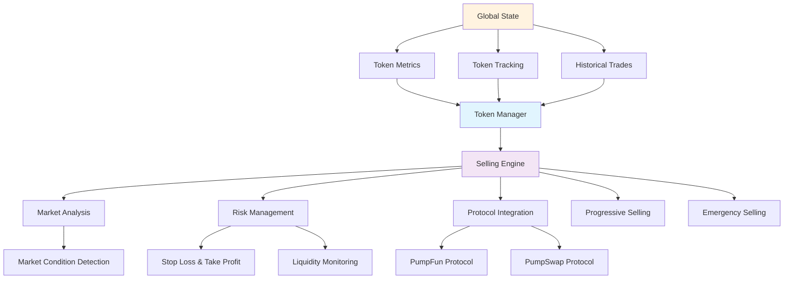

# Solana PumpFun/PumpSwap Copy Trading Bot  [📞Contact me](https://t.me/deniyuda348)
## Overview
Pump Fun, Pump Swap Copy Sniper Bot.
https://github.com/deniyuda348/pump-fun-pump-swap-sniper-copy-bot/wiki
# Features:

- **Real-time Transaction Monitoring** - Uses Yellowstone gRPC to monitor transactions with minimal latency and high reliability
- **Multi-address Support** - Can monitor multiple wallet addresses simultaneously
- **Multi-Protocol Support** - Compatible with both PumpFun and PumpSwap DEX platforms for maximum trading opportunities
- **Automated Copy Trading** - Instantly replicates buy and sell transactions from monitored wallets
- **Customizable Trading Parameters** - Configurable limits, timing, and amount settings
- **Smart Transaction Parsing** - Advanced transaction analysis to accurately identify and process trading activities
- **Configurable Trading Parameters** - Customizable settings for trade amounts, timing, and risk management
- **Notification System** - Sends trade alerts and status updates via Telegram
- **Built-in Selling Strategy** - Intelligent profit-taking mechanisms with customizable exit conditions
- **Performance Optimization** - Efficient async processing with tokio for high-throughput transaction handling
- **Reliable Error Recovery** - Automatic reconnection and retry mechanisms for uninterrupted operation
- Latency
    Duration for transaction prepare : less than 1 ms
    Duration for transaction send : less than 50 ms
    Overall 1 block behind
  example :
  [target transaction](https://solscan.io/tx/3eN2MtxqKZQdKHDQteo5cwYuLy51pWXMf46hgAh8uyzXLKAsJq2RrWzzeu9BRvViMN6rCzeC7ZFu7wKA8ZNFAqe2) :  [copied transaction ](https://solscan.io/tx/4ahzZ5tj3489Mbxsi6fe9qjCJwMVUd5zHmu1d2S5PM9C5LswdE2ntvguFsH13pAbxGJEqFRh5cM6EcCB2wn588en)

## EMERGENCY SELL

